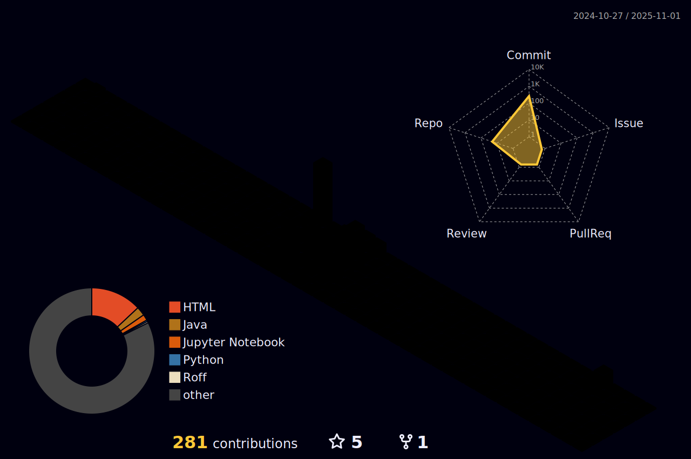

## Hi there, Welcome to Yanhao's Github Page 👋

<!--
**yanhao13/yanhao13** is a ✨ _special_ ✨ repository because its `README.md` (this file) appears on your GitHub profile.

Here are some ideas to get you started:

- 🔭 I’m currently working on ...
- 🌱 I’m currently learning ...
- 👯 I’m looking to collaborate on ...
- 🤔 I’m looking for help with ...
- 💬 Ask me about ...
- 📫 How to reach me: ...
- 😄 Pronouns: ...
- ⚡ Fun fact: ...
-->

<!--
Snake
-->
<picture>
  <source 
    media="(prefers-color-scheme: dark)" 
    srcset="https://raw.githubusercontent.com/yanhao13/yanhao13/output/github-contribution-grid-snake-dark.svg">
  <source 
    media="(prefers-color-scheme: light)" 
    srcset="https://raw.githubusercontent.com/yanhao13/yanhao13/output/github-contribution-grid-snake.svg">
  
</picture>

<!--
Stats Card
-->

<!--
Lang Used
-->

<!--
Streak
-->

<!-- 
3D Contribution
-->
<picture>
  <source 
    media="(prefers-color-scheme: dark)" 
    srcset="./profile-3d-contrib/profile-night-rainbow.svg">
  <source 
    media="(prefers-color-scheme: light)" 
    srcset="./profile-3d-contrib/profile-gitblock.svg">
  
</picture>
